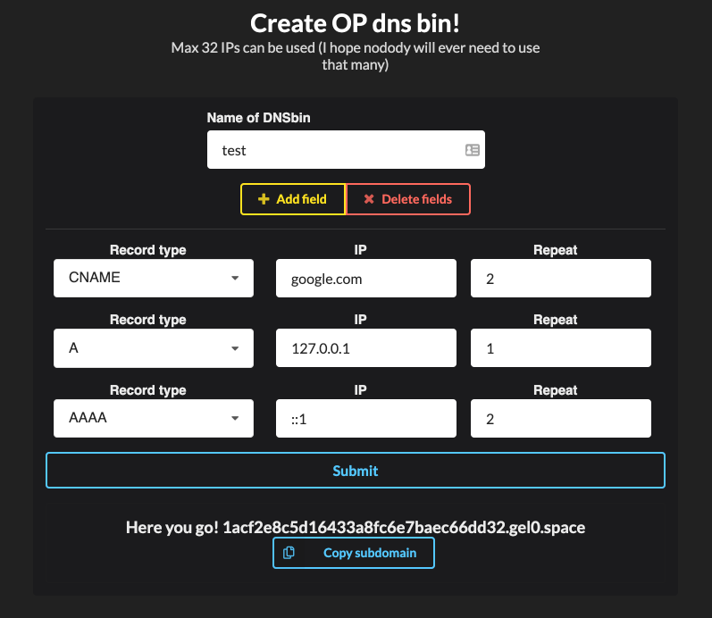
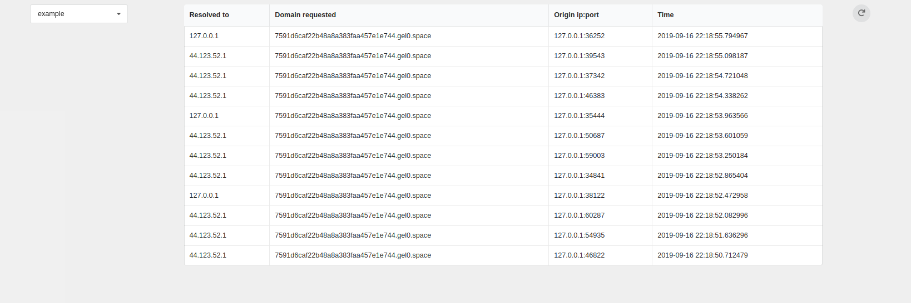

# DnsFookup v 2.0.1
[DNS Rebinding](https://en.wikipedia.org/wiki/DNS_rebinding) freamwork containing:
 - a dns server obviously
 - python web api to create new subdomains and control the dns server, view logs, stuff like that
 - shitty react app to make it more comfy

 [Changelog](./CHANGELOG.md)
 [API documentation](./API.md)

## What does it do?
It lets you create dns bins like a burp collaborator
but it adds a bit more features...


You can specify what ips/domains should the created subdomain resolve to and how many times, for now it *A,CNAME and AAAA record are supported*

Then you can see where it was requested from, what did it resolve to,... in logs



## How to run it

First of all, check the configuration in config.yaml


You also should not forget to change all passwords and keys inside the config


```
#Set up postgres and redis
sudo docker-compose up

#in ./BE
pip3 install -r requirements.txt

python3 dns.py # to start the dns server

# for testing purposes development server is enough I think
FLASK_APP=app.py
FLASK_ENV=development
flask run

# then in ./FE
npm install
npm start
```


# PLEASE

*If you have a bit of free time, please contribute, it means a lot to me :D*

# Want to see some feature in next update?
## Let me know [on keybase](https://keybase.io/gel0)
